<p align="center">
  
</p>

<p align="center">
  
  
  
  
  
  
</p>

A REST API that keeps track of your subscriptions, adds up what they cost, and emails you before each one renews. It runs entirely on free tiers.

## Features

- **Accounts:** sign up and sign in with a JWT token. Passwords are stored only as hashes.
- **Subscriptions:** create, list, filter, update, pause, cancel and delete. Free trials are supported.
- **Spending summary:** monthly and yearly totals per currency and category.
- **Renewal reminders:** an email 7, 5, 2 and 1 days before a subscription renews.
- **Protection:** rate limiting, bot detection and sign-up email validation with Arcjet.

## How it works

<p align="center">
  
</p>

Every request passes through Arcjet and the auth check before it reaches a route. Separately, Upstash Workflow calls the API once a day to run the daily check.

## Reminders

<p align="center">
  
</p>

The daily check does two things:

1. Emails the owner of every active subscription that renews in 7, 5, 2 or 1 days.
2. Moves the renewal date forward one period for every subscription that renewed. A free trial that has ended becomes a normal paid subscription.

Paused and cancelled subscriptions are skipped.

## Getting started

You need **Node.js 24.5 or newer** and a free [MongoDB Atlas](https://www.mongodb.com/atlas) cluster.

```bash
git clone https://github.com/Thenuja-Hansana/subscription-tracker.git
cd subscription-tracker
npm install
cp .env.example .env.development.local
```

Fill in `.env.development.local`:

| Variable | Needed | What it is |
|---|---|---|
| `DB_URI` | Yes | MongoDB Atlas connection string |
| `JWT_SECRET` | Yes | Any long random text. It signs the login tokens. |
| `ARCJET_KEY` | No | Key from [Arcjet](https://arcjet.com). Without it the API runs unprotected. |
| `EMAIL_USER`, `EMAIL_PASSWORD` | No | A Gmail address and its app password. Without them, reminders are printed in the terminal. |

Then start the API:

```bash
npm run dev
```

It runs at `http://localhost:3000`. No Upstash account is needed on your own computer: `QSTASH_DEV=true` runs a local Upstash server for you. When the API is hosted, use the three `QSTASH_` values listed in `.env.example` instead.

## API

All paths start with `/api/v1`. Everything except sign up and sign in needs the header `Authorization: Bearer <token>`.

| Method | Path | What it does |
|---|---|---|
| `POST` | `/auth/sign-up` | Create an account and get a token |
| `POST` | `/auth/sign-in` | Get a token |
| `GET` | `/users/me` | Your profile |
| `POST` | `/subscriptions` | Add a subscription |
| `GET` | `/subscriptions` | List yours. Filter with `?status=` and `?category=` |
| `GET` | `/subscriptions/summary` | Monthly and yearly spending |
| `GET` | `/subscriptions/:id` | View one |
| `PATCH` | `/subscriptions/:id` | Change fields, or pause and cancel with `status` |
| `DELETE` | `/subscriptions/:id` | Delete one |

Only `name`, `price` and `frequency` are required to add a subscription:

```json
{
    "name": "Netflix",
    "price": 15.99,
    "frequency": "monthly",
    "category": "entertainment"
}
```

[requests.http](requests.http) has a ready-made request for every endpoint. Open it in VS Code with the REST Client extension and click **Send Request**.

## Scripts

| Command | What it does |
|---|---|
| `npm run dev` | Start the API and restart it when a file changes |
| `npm start` | Start the API |
| `npm test` | Run the tests against an in-memory database |
| `npm run lint` | Check the code with ESLint |
| `npm run daily-check` | Run the daily check now instead of waiting for 09:00 UTC |

## Project structure

```
app.js            Builds the Express app
server.js         Connects to the database and starts the server
config/           Environment variables, Arcjet, Upstash, email
controllers/      What each route does
middlewares/      Auth check, Arcjet protection, error handling
models/           User and subscription
routes/           URL to controller mapping
utils/            Renewal dates, daily check, email template
tests/            Vitest tests
```
